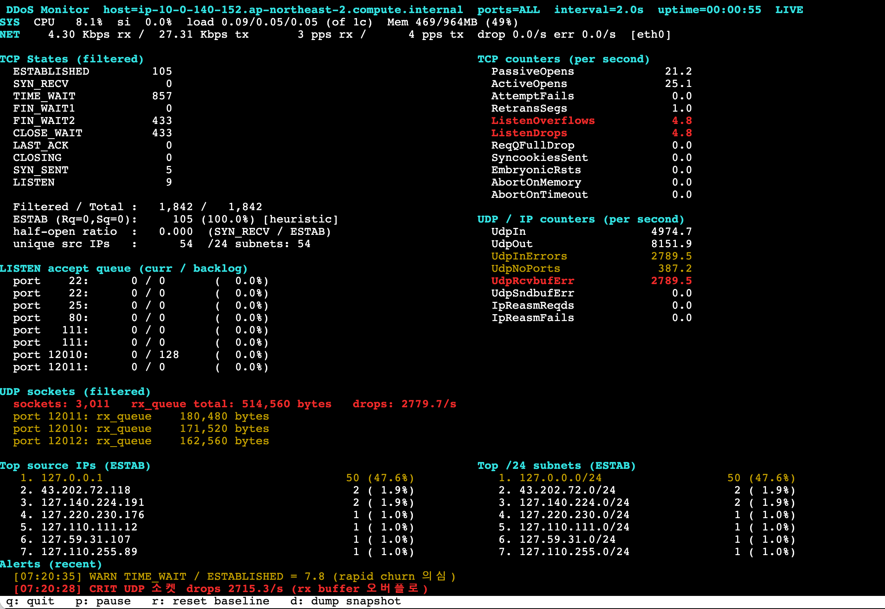

# EC2 애플리케이션 레벨 DDoS 실시간 모니터링 도구

AWS Shield 와 Global Accelerator 뒤에 있는 EC2 인스턴스에서, **엣지 방어를 우회한 트래픽이 인스턴스까지 도달했을 때** 그 영향을 실시간으로 관찰하기 위한 단일 파일 파이썬 도구입니다. 

- **단일 파일 · 표준 라이브러리만 사용** — 배포 EC2 에 그대로 복사해서 실행
- **Python 3.9+** — Amazon Linux 2/2023, Ubuntu 20.04+ 기본 파이썬으로 동작
- **읽기 전용** — 시스템 설정을 절대 수정하지 않음
- **터미널 UI (curses) 또는 JSON Lines 출력** — 사람이 보거나 JSON 으로 출력하여 로그 기록 


### 데이터 소스 — /proc 직접 파싱

| 항목 | 소스 파일 | 비고 |
|---|---|---|
| TCP 소켓 상태 / 큐 | `/proc/net/tcp`, `/proc/net/tcp6` | world-readable, root 불필요 |
| UDP 소켓 상태 / drops | `/proc/net/udp`, `/proc/net/udp6` | drops 컬럼은 커널 3.0+ 부터 |
| 커널 TCP/UDP/IP 카운터 | `nstat -az` (실패 시 `/proc/net/{snmp,netstat}`) | 절대값을 도구가 델타로 변환 |
| CPU / 메모리 / load | `/proc/stat`, `/proc/meminfo`, `/proc/loadavg` | |
| NIC bytes/pkts/drops/errors | `/proc/net/dev` | rx/tx 각각 |
| conntrack 사용률 | `/proc/sys/net/netfilter/nf_conntrack_{count,max}` | 모듈 로드된 경우만 |
| 프로세스 상세 (`--pid/--pname`) | `/proc/<pid>/{stat,status,fd}` | |


## 설치 및 실행

의존성이 없으므로 파일 하나만 있으면 됩니다.

```bash
# EC2 로 복사
scp ddos_monitor.py ec2-user@target:/usr/local/bin/

# 실행
python3 /usr/local/bin/ddos_monitor.py --ports 12010-12020
```

root 는 필요 없지만, 다른 유저 소유 프로세스의 fd 카운트를 정확히 보려면 sudo 가 필요할 수 있습니다.

권장 파이썬 버전: **3.9 이상**. Amazon Linux 2023, Ubuntu 22.04+ 기본 python3 로 그대로 실행 가능. Amazon Linux 2 는 `python3.8` 이상 설치 필요.


## 수집 지표

### 시스템 리소스 (헤더 3줄)

| 지표 | 의미 | 데이터 소스 |
|---|---|---|
| **CPU %** | 전체 CPU 사용률 (non-idle jiffy delta 비율) | `/proc/stat` |
| **si %** | softirq 만 따로 뽑은 CPU 시간. NET_RX 단일 코어 병목의 신호 | `/proc/stat` |
| **load 1/5/15** | uptime load average. `> ncpu` 이면 오버로드 신호 | `/proc/loadavg` |
| **Mem used / total** | `MemTotal - MemAvailable`. buffer/cache 를 free 로 취급 | `/proc/meminfo` |
| **NIC bps rx/tx** | 선택 NIC 들의 rx/tx bytes 델타 × 8 | `/proc/net/dev` |
| **NIC pps rx/tx** | 초당 패킷 수. **volumetric flood 는 대부분 bps 보다 pps 로 먼저 포화됨** (EC2 ENA 는 PPS 한도 존재) | `/proc/net/dev` |
| **drop / err** | rx_dropped, rx_errors rate. **NIC 큐 오버런 = EC2 대역폭/PPS 상한 도달의 직접 증거** | `/proc/net/dev` |
| **conntrack** | count/max 및 사용률 %. 80% 넘으면 신규 연결 거부 위험 | `/proc/sys/net/netfilter/` |

### 프로세스 지표 (`--pid` / `--pname` 사용 시)

| 지표 | 의미 | 비고 |
|---|---|---|
| **CPU %** | 해당 프로세스 CPU (개별 코어 기준, 100% = 1 core) | `/proc/pid/stat` utime+stime |
| **RSS** | 실제 사용 물리 메모리 MB | |
| **threads** | 스레드 수 | 게임 서버 accept 스레드 폭주 감지 |
| **fds** | 열린 파일 디스크립터 수 | `EMFILE` 사전 감지 |
| **ctx v/nv** | voluntary / non-voluntary context switch rate | nv 급증 = 짧은 연결 폭주 신호 |

### TCP 지표

| 지표 | 의미 |
|---|---|
| **ESTABLISHED** | 활성 TCP 연결 수 |
| **SYN_RECV** | half-open. 3-way 진행 중. SYN flood 의 직접 지표 |
| **TIME_WAIT** | 최근 종료 연결. **TIME_WAIT/ESTAB > 5 = rapid churn 공격 의심** |
| **half-open ratio** | `SYN_RECV / ESTAB`. 정상 시 거의 0. **> 0.5 → CRIT** |
| **Filtered / Total** | `--ports` 필터에 걸린 연결 / 시스템 전체 연결 |
| **ESTAB (Rq=0,Sq=0)** | 큐가 모두 비어 있는 ESTAB 수. **`[heuristic]` — false-positive 많음. 참고용** |
| **unique src IPs / /24 subnets** | 소스 다양성. 봇넷 스푸핑 유형은 여기가 튐 |
| **Long-idle ESTAB** (`--track-age`) | 관찰 후 N 초 지났는데도 Rq=Sq=0 인 연결. **handshake 후 abandon 공격의 정확한 신호** |
| **LISTEN accept queue** | 포트별 현재 대기 / 최대 backlog. **80% 넘으면 애플리케이션이 accept 를 못 따라잡음** |

### 커널 TCP 카운터 (per-second delta)

| 카운터 | 의미 | 0 아니면 |
|---|---|---|
| **PassiveOpens** | 신규 accept 완료 rate. baseline 대비 급증 = 연결 flood | (rate) |
| **ActiveOpens** | outbound 연결 rate | |
| **AttemptFails** | 연결 실패 rate | |
| **RetransSegs** | TCP 재전송 rate. 링크 포화/큐잉 지연 신호 | |
| **ListenOverflows** | listen queue overflow. **backlog 포화 시작** | CRIT |
| **ListenDrops** | listen 단계 드롭 | CRIT |
| **ReqQFullDrop** | request queue full | CRIT |
| **SyncookiesSent** | SYN cookie 발동. **SYN flood 진행 중** | WARN |
| **EmbryonicRsts** | half-open 강제 종료 | (관찰) |
| **AbortOnMemory** | 메모리 부족으로 연결 중단 | CRIT |
| **AbortOnTimeout** | 타임아웃 abort | WARN |

### 커널 UDP / IP 카운터 (per-second delta)

| 카운터 | 의미 | 0 아니면 |
|---|---|---|
| **UdpIn / UdpOut** | UDP pps | (rate) |
| **UdpInErrors** | 체크섬 오류 등 | WARN |
| **UdpNoPorts** | 리스닝 안 하는 포트로 온 UDP. **반사(amplification)/스캔 신호** | WARN (baseline × 5 초과 시) |
| **UdpRcvbufErr** | **소켓 rx 버퍼 오버플로**. TCP 의 ListenOverflows 상당. 애플리케이션이 UDP 못 따라잡음 | CRIT |
| **UdpSndbufErr** | 송신 병목 | WARN |
| **IpReasmReqds / IpReasmFails** | IP fragment reassembly. **Fails ≥ 5/s = fragmentation 공격 의심** | WARN |

### UDP 소켓 상태 (필터된 포트)

| 지표 | 의미 |
|---|---|
| **sockets** | 필터에 걸린 리스닝 UDP 소켓 수 |
| **rx_queue total** | 커널 버퍼에 쌓여 있고 애플리케이션이 아직 읽지 않은 바이트 총합 |
| **drops/s** | 소켓 drops 카운터 델타. **> 0 이면 CRIT** — rx buffer 오버플로 |
| **port N: rx_queue** | 소켓별 rx_queue 상위 6개. **64KB↑ WARN / 512KB↑ CRIT** |

### 소스 분포

| 섹션 | 의미 |
|---|---|
| **Top source IPs (ESTAB)** | ESTABLISHED 연결의 소스 IP 상위 N (`--top`). 점유율 표시 |
| **Top /24 subnets (ESTAB)** | 소스 IP 를 /24 (IPv6 는 /64) 로 접은 상위 N. 봇넷 대역 특정 |
| **Ports (ESTAB)** | 로컬 포트별 ESTABLISHED 분포 요약 |

카운터가 상한 (`--src-track-limit`, 기본 50,000) 을 초과하면 **`+ (HLL~N)`** 형식으로 표시됩니다. 이때 상위 N 은 정확히 유지되고, 진짜 unique 수는 HyperLogLog 로 ±3% 정도의 추정치가 나옵니다.

### 알람

각 지표는 두 방식 중 하나로 알람이 발화합니다:

- **절대 임계**: 특정 값을 넘으면 (예: `ListenOverflows > 0/s`)
- **베이스라인 대비**: 최근 tick 들의 중앙값 × N 배 + 절대 floor 를 넘으면 (예: `PassiveOpens/s > baseline × 5`)

같은 지표 알람은 10초 cooldown. 화면 최하단에 최근 2개가 색상별로 표시됩니다 (**CRIT** = 빨강 / **WARN** = 노랑).


## 화면 예시




## CLI 옵션

| 옵션 | 기본값 | 설명 |
|---|---|---|
| `--ports` | (없음, 전체) | 로컬 포트 필터. 단일 (`12010`) 또는 범위 (`12010-12020`). 지정 안 하면 시스템 전체 소켓 |
| `--interval` | `2.0` | 수집 주기(초). DDoS 상황에서는 3-5s 권장 (도구 부하 절감) |
| `--top` | `15` | 소스 IP / /24 서브넷 상위 표시 개수 |

### 관찰 강화 옵션

| 옵션 | 기본값 | 설명 |
|---|---|---|
| `--track-age` | off | ESTABLISHED 5-tuple 을 처음 관찰한 시각을 추적하여 `Long-idle ESTAB` 카운트 계산. 메모리는 5-tuple 수 × 몇십 바이트 |
| `--idle-age` | `30.0` | `--track-age` 활성 시 idle 판정 임계 (초). "Rq=Sq=0 AND age ≥ 임계" 인 연결을 long-idle 로 카운트 |
| `--pid` | | 특정 PID 를 모니터링 (CPU/RSS/threads/fd/ctx) |
| `--pname` | | comm 이 일치하는 프로세스 자동 탐색. 기본은 exact match, 여러 매치 시 최소 PID |
| `--pname-substring` | off | `--pname` 을 substring 매치로 (예: `--pname server` 가 `sshd` 를 잡을 위험이 있으니 필요할 때만) |
| `--nics` | 자동 (`lo` 제외) | 네트워크 사용량 집계 NIC 목록 (콤마 구분). 예: `eth0` |
| `--no-ipv6` | off | `/proc/net/tcp6`, `/proc/net/udp6` 스캔 생략 |

### 튜닝 옵션

| 옵션 | 기본값 | 설명 |
|---|---|---|
| `--baseline-window` | `60` | baseline 중앙값 계산 윈도우 (tick 개수). `--interval 2` 이면 최근 120초 |
| `--src-track-limit` | `50000` | 소스 IP / /24 카운터 상한. 봇넷 스푸핑 대응. 상한 초과분은 top-K 유지 목적으로 스킵되고 HLL 로 unique 수만 추정 |

### 출력 옵션

| 옵션 | 기본값 | 설명 |
|---|---|---|
| `--json` | off | curses UI 대신 tick 마다 stdout 으로 JSON 1줄 출력 (파일 파이프 or SIEM ingest 용) |
| `--log` | | 알람 이벤트를 JSON Lines 로 기록할 파일 경로. 중복 없이 새 알람만 append |

### 사용 예

```bash
# 게임 서버 포트 범위 실시간 모니터링 (curses UI)
sudo python3 ddos_monitor.py --ports 12010-12020 --interval 2

# 프로세스 모니터링까지 함께
sudo python3 ddos_monitor.py --ports 12010-12020 --pname gameserver --nics eth0

# handshake 후 abandon 유형 감지 강화
sudo python3 ddos_monitor.py --ports 12010-12020 --track-age --idle-age 30

# JSON 스트리밍 (SIEM/파일)
python3 ddos_monitor.py --ports 12010-12020 --json > /var/log/ddos_mon.jsonl

# 알람 이벤트만 별도 파일로
python3 ddos_monitor.py --ports 12010-12020 --log /var/log/ddos_alerts.jsonl
```

### 키 조작 (curses UI)

| 키 | 동작 |
|---|---|
| `q` | 종료 |
| `p` | 일시정지 (수집 정지, 마지막 화면 유지) |
| `r` | baseline 리셋 (알람 워밍업 다시 시작) |
| `d` | 현재 스냅샷을 `--log` 파일에 수동 dump |

---


## 안전성 참고

- **읽기 전용**: `--log` 파일 외에는 어떤 파일도 쓰지 않음. `/proc/sys` 나 sysctl 변경 없음.
- **subprocess 최소화**: `nstat -az` 만 사용, 5초 타임아웃, 실패 시 `/proc` 폴백.
- **메모리 상한**: 소스 IP 카운터 상한 (`--src-track-limit`), age tracker 상한 200k. 초과 시 SATURATED 표시 (UI/JSON 노출).
- **파싱 실패 방어**: `/proc/net/{tcp,udp}` 각 줄 파싱 예외 캐치, malformed 줄은 건너뜀. `/proc/stat` 은 `ValueError` 도 처리. curses `erase()/refresh()` 도 예외 보호.

대량 소켓 (수십만 이상) 상황에서는 `--interval` 을 3-5초로 늘려주는 것이 안전합니다. 


## JSON 스키마 (`--json`)

각 라인은 하나의 JSON 오브젝트. 주요 키:

```json
{
  "ts": 1721635000.12,
  "host": "game-01",
  "state_counts": {"ESTABLISHED": 12340, "SYN_RECV": 842, ...},
  "top_sources": [["203.0.113.42", 842], ...],
  "top_dst_ports": [[12010, 4231], ...],
  "unique_source_ips_tracked": 50000,
  "unique_source_ips_hll": 342180,
  "src_ips_saturated": true,
  "half_open_ratio": 0.068,
  "listen_queues": [[12010, 102, 128], ...],
  "long_idle_established": 1821,
  "rates": {"PassiveOpens": 320.4, "ListenOverflows": 12.0, ...},
  "sys": {"cpu_pct": 38.2, "softirq_pct": 4.1, "mem_pct": 32, ...},
  "proc": {"pid": 1234, "name": "gameserver", "cpu_pct": 62.8, ...},
  "udp": {"socket_count": 5, "total_rx_queue": 18240, "drops_rate": 0.0, ...},
  "age_tracker": {"size": 54201, "max": 200000, "saturated": false},
  "alerts": [{"ts": 1721635000.1, "severity": "CRIT", "msg": "..."}]
}
```

